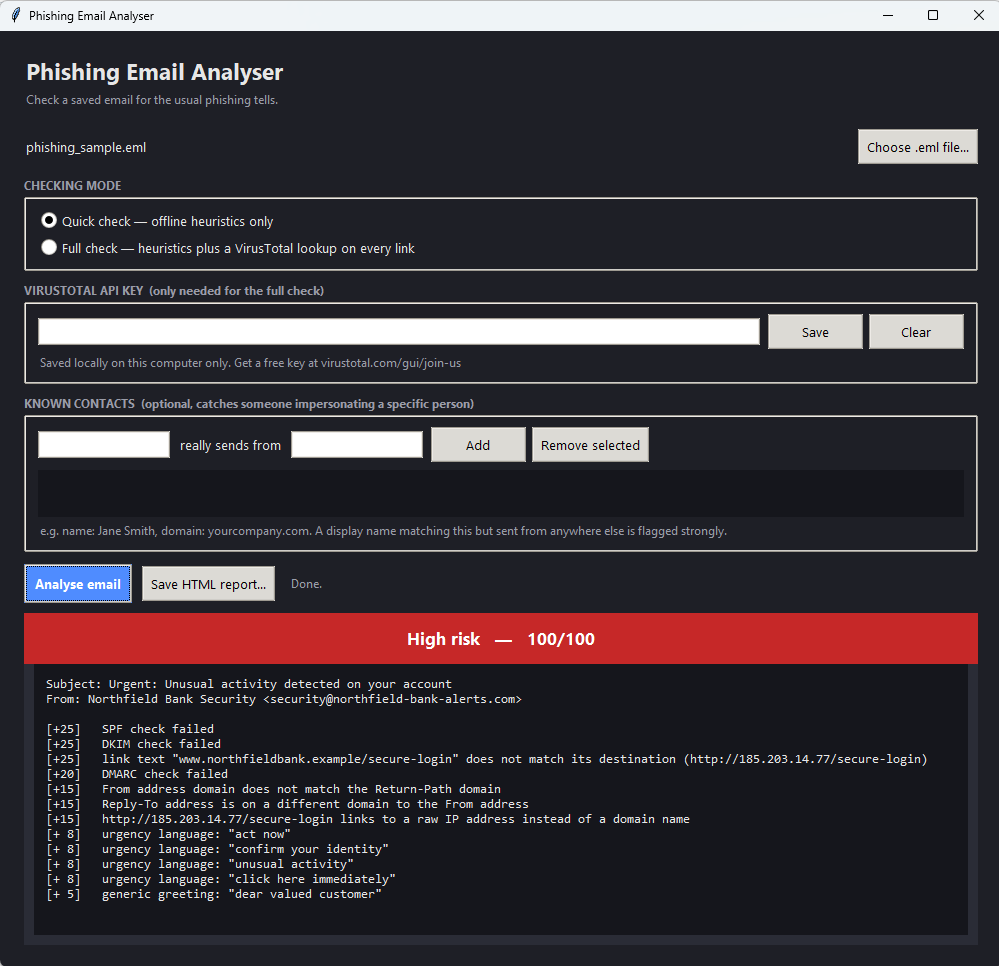
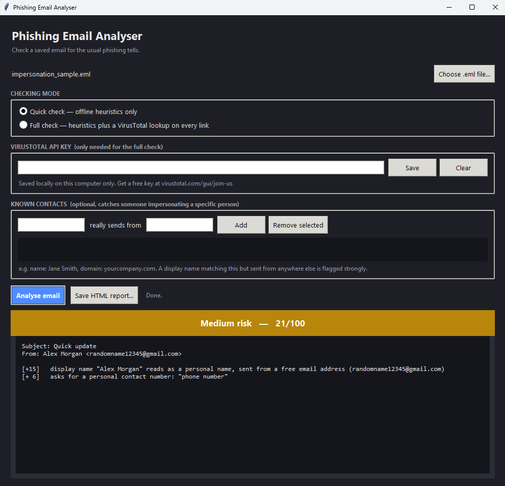

# Phishing Email Analyser

A small desktop tool that checks a saved email for the tricks phishing and
business email compromise scams actually rely on, failed authentication,
disguised links, and someone impersonating a real person, and gives it a
plain Low, Medium or High risk score.

No external services required to get a result, and no dependencies
beyond Python itself.



## Why this exists

This started as a way to put some structure around the phishing
awareness training I run at work, rather than relying on "does this look
dodgy" gut feel alone. It's built to catch what a lot of simpler tools
miss: an email can pass every authentication check and still be a scam,
if it was sent through a completely genuine free email account that
simply isn't the person it claims to be. See
[docs/CHECKS.md](docs/CHECKS.md) for exactly how and why.

## Features

- **Authentication checks**, SPF, DKIM, DMARC, and sender address
  alignment
- **Link checks**, raw IP links, URL shorteners, punycode domains,
  disguised link text
- **Impersonation detection**, catches a display name pretending to be
  someone specific, including cases that pass authentication cleanly
- **Optional VirusTotal lookups**, real threat intelligence on top of the
  built-in heuristics, only when you choose to turn it on
- **Desktop GUI**, no terminal required, with a saved API key and a
  saved contacts list so you only set things up once
- **Command line tool**, for scripting or anyone who prefers it
- **HTML report export**, to save or forward a result

## Screenshots

*(Add your own here, see the "Taking your own screenshots" section
below for what's worth capturing.)*




## Getting started

Requires Python 3.9 or later. Nothing else to install.

```bash
git clone https://github.com/<your-username>/phishing-email-analyser.git
cd phishing-email-analyser
python3 gui.py
```

On Linux, if the window doesn't open and mentions `tkinter`, run
`sudo apt install python3-tk` first. Windows and Mac installers include
it already.

## How to use it

1. **Get a `.eml` file to check.** Most mail clients let you export a
   single email:
   - **Gmail**: open the email, click the three-dot menu, "Show
     original", then "Download original"
   - **Outlook**: drag the email out of the message list onto your
     desktop
   - Or use one of the sample files in `samples/`, included so you can
     try the tool immediately without needing a real phishing email to
     hand
2. **Open the app** and click **Choose .eml file...** to select it.
3. **Pick a checking mode.**
   - *Quick check* runs everything offline, instantly, no setup.
   - *Full check* also looks up every link on VirusTotal. Needs a free
     API key, see below.
4. **(Optional) Save a VirusTotal API key.** Get one free at
   [virustotal.com/gui/join-us](https://www.virustotal.com/gui/join-us),
   paste it in, click **Save**. It's stored locally on your machine and
   only sent to VirusTotal itself.
5. **(Optional) Add known contacts.** If someone impersonates a real
   colleague, the tool can only catch it if it knows what that person's
   real email domain looks like. Add a name and their actual domain
   under **Known contacts**, this is the single strongest check the tool
   has.
6. **Click Analyse email.** The banner along the top turns green, amber
   or red, with every reason listed underneath, each with the number of
   points it added to the score.
7. **(Optional) Save HTML report...** to keep or forward a copy of the
   result.

### Command line, if you'd rather script it

```bash
python3 cli.py path/to/email.eml
python3 cli.py path/to/email.eml --html report.html
```

## Taking your own screenshots

Two are worth capturing to show the tool actually doing something, not
just sitting empty:

1. **Run the quick check on `samples/phishing_sample.eml`.** This gives
   you the full red High risk banner with authentication failures and
   disguised links listed, the clearest single image of what the tool
   does.
2. **Add a known contact, then run the quick check on
   `samples/impersonation_sample.eml`.** Add the name "Alex Morgan"
   against the domain `example-corp.co.uk` under Known contacts, then
   analyse the email. It jumps to High on the identity mismatch alone,
   a good second screenshot since it shows the impersonation check
   actually working, not just the obvious phishing case.

Save them into the `screenshots/` folder using the filenames already
referenced above (`gui-high-risk.png`, `gui-impersonation.png`), and
they'll appear in this README automatically once pushed to GitHub.

## Example output

```
============================================================
Phishing Email Analyser
============================================================
Subject : Urgent: Unusual activity detected on your account
From    : Northfield Bank Security <security@northfield-bank-alerts.com>
Risk    : High (100/100)
------------------------------------------------------------
  [+25] SPF check failed
  [+25] DKIM check failed
  [+25] link text "www.northfieldbank.example/secure-login" does not match its destination (http://185.203.14.77/secure-login)
  [+20] DMARC check failed
  [+15] From address domain does not match the Return-Path domain
  [+15] Reply-To address is on a different domain to the From address
  [+15] http://185.203.14.77/secure-login links to a raw IP address instead of a domain name
  [+ 8] urgency language: "act now"
  [+ 8] urgency language: "confirm your identity"
  [+ 8] urgency language: "unusual activity"
  [+ 8] urgency language: "click here immediately"
  [+ 5] generic greeting: "dear valued customer"
============================================================
```

More examples, including the impersonation case, are in
[docs/CHECKS.md](docs/CHECKS.md).

## Project structure

```
phishing-email-analyser/
├── cli.py                  command line entry point
├── gui.py                  desktop GUI entry point
├── analyser/
│   ├── parser.py           loads a .eml file and gets at its body
│   ├── auth.py              SPF/DKIM/DMARC and sender alignment checks
│   ├── urls.py              link extraction and red-flag checks
│   ├── language.py          wording checks
│   ├── reputation.py        optional VirusTotal lookups
│   ├── impersonation.py     display-name / identity impersonation checks
│   ├── contacts.py          saves known contacts locally for the GUI
│   ├── api_key_store.py     saves the VirusTotal key locally for the GUI
│   ├── scoring.py           combines everything into one risk score
│   └── report.py            console and HTML output
├── samples/                 three test emails, safe to run against
├── docs/CHECKS.md           detailed explanation of every check
└── screenshots/             for your own screenshots, see above
```

## Licence

MIT, see [LICENSE](LICENSE).
